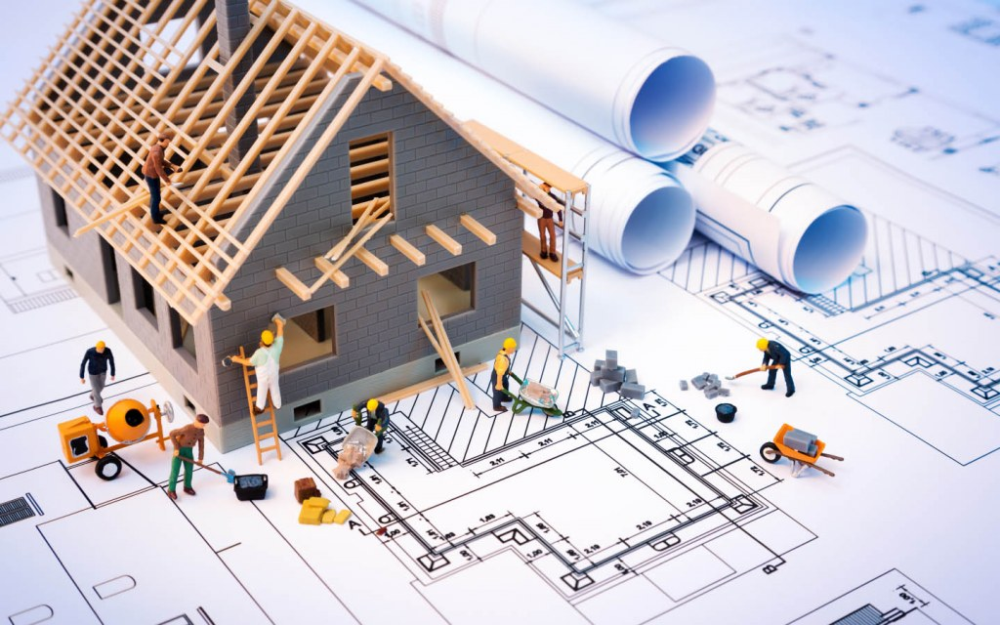

## Building and Construction

To me, design patterns can be seen as building a house. In the field of construction, there are a set of common rules that workers should follow when building a house, such as starting with the structure of the exterior, then the interior, or finishing the foundation before starting the framing and structure. These sets of practices are the standard and recommended ways of building a house. However, these practices generally don't limit the constructor workers as well as the homeowners ability to choose the materials to use for the house after the foundation has been laid. This allows flexibility for the user to  build on top of the foundation that it provides with their own choice of brick and mortar. This same foundation can then be used by another builder, but this time, they're using blue paint instead of red. In other words, anyone can follow these instructions and fill in with their own choice of materials to build a house completely different from their neighbors, but would still serve the same purpose. These rules also make it easy for everyone working on the project to be on the same page, as everyone is able to understand the work that needs to be done and when it needs to be done to successfully complete the project. 

## How Our Group's House is Built

For our house, many of the design patterns we utilized are patterns built into Meteor, as well as patterns we took from the template we built our project on. First we hired an inspector who subscribes to our databases and collections to do regular inspections on the project, to make sure all updates and new additions are documented and reflected properly. If the inspector reports an error, then we know something is wrong with our databases and that it needs to be fixed before the inspector can continue their work. 

After that, because we are choosing to supply the construction company with our own materials, we looked for a 3rd party company who makes custom display cases to display our items in. We then include these display cases in wherever parts of the house that needs to use the display case, that way everything stays consistent, and simplifies the project. We have several of these custom components throughout the house to keep everything simple and organized. 

Finally, we looked to order things that we only needed one of, but was crucial for our house to function as a house. These are usually things that inspectors look for, such as an electrical system, plumbing system, and other collection of parts that help keep the house running. These collections are used throughout the entire project, and sometimes, when one stops working, the entire project stops functioning. 

## Thoughts After Most of the House Has Been Built

Looking back to when the project was just starting, I had no idea any of these patterns that the construction crew introduced to me. At first, it was very abstract and difficult to understand, however after doing some of my own research and looking at examples online, I slowly got a better grasp of the concept. Although I am no master, I am confident that it's one of the core concepts that I learned while doing this project.