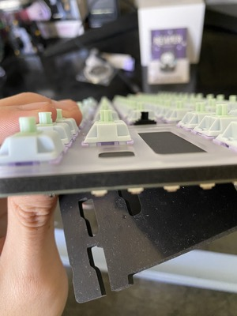
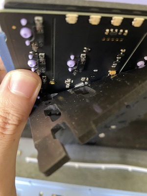

  
  

After using membrane keyboards for most of my life, I've finally decided to go down the rabbit hole of mechanical keyboards, a topic that I've heard several times from both online and real life friends. A mechanical keyboard has 5 main parts, the case of the keyboard, the pcb of the keyboard, the board you use along with the PCB, the switches you mount onto the board and PCB, and finally the keycaps that you actually type on. Ever since the mechanical keyboard was created during the 1970s, there has been hundreds of new designs and materials that has been used in the construction of a mechanical keyboard. To the custom enthusiasts out there, each individual part has been carely selected and assembled to fit their own unique tastes. With every part you choose, it will alter both the sound and feel of the keyboard. 

During my research, I learned about the uses of the PCB, different types of plates and their materials, the 3 different switch types, and keycap profiles. There are 2 different types of PCB, either hotswap or not. With hotswap, you can simply pop in your switches through the pins, whereas the other models, you'll have to individually solder in each switch into the slot, which is both time consuming and sometimes dangerous. When selecting plates, it depends on your preference on the typing experience, either soft or stiff, as well as some slight sound differences between plates. The component that affects the typing experience as well as sound the most would be the switches. As mentioned before, there are 3 different types of switches, linear, tactile, or clicky. Most enthusiasts prefer the more silent and smooth linears, with some preferring the tactiles, which has a slight bump that bounces back at your fingers when you actuate a key. After that is done, you are left with choosing the keycaps, which comes in many different profiles and layouts. The most popular and common profile is called the "Cherry" profile, named after the famous keyboard switch company "Cherry". This profile features height differences between each row of the keyboard, whereas other profiles might have all the same tall profile as the function keys, or a slight height difference between rows. 

It was a very fun and enjoyable experience researching about mechanical keyboards, especially when it comes to actually assemblying the keyboard. Building my own custom one has only made the experience even better, as I enjoy typing even more now. 
